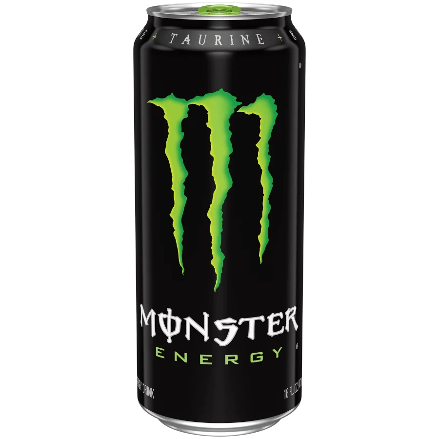
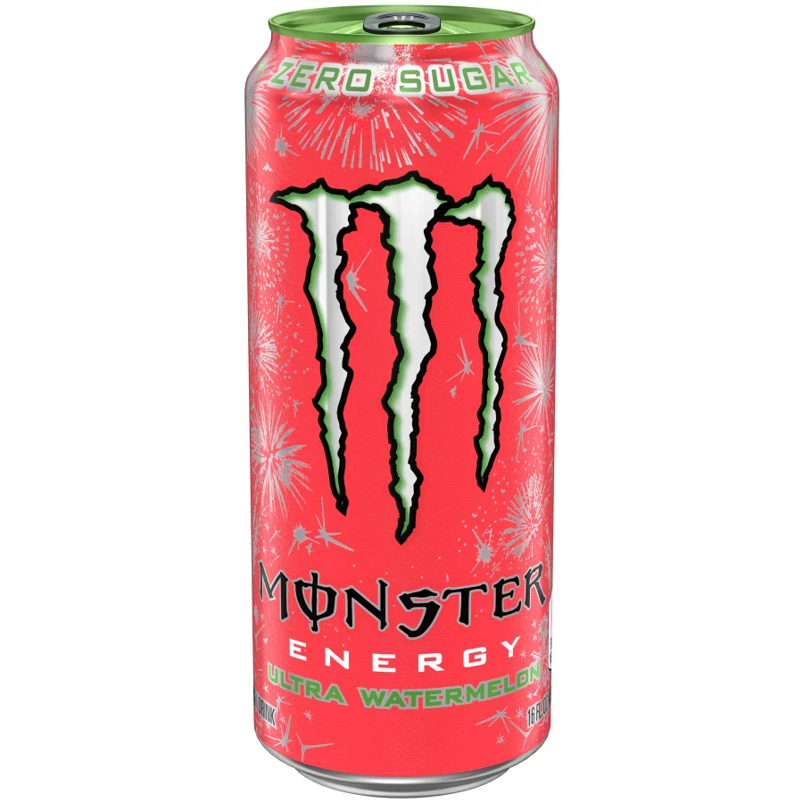
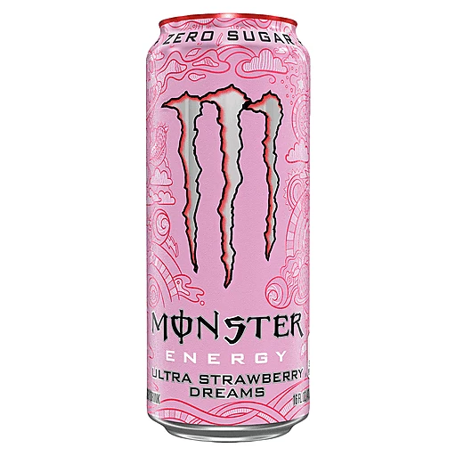
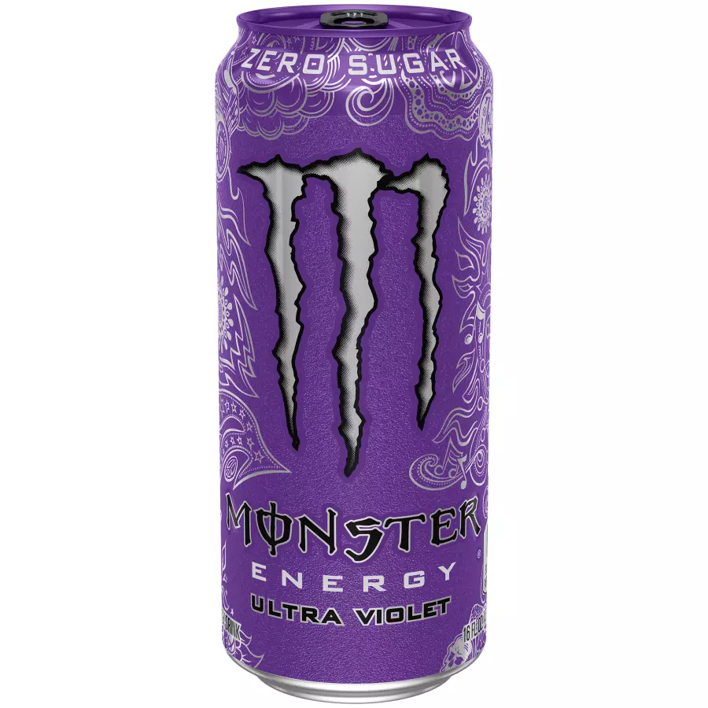
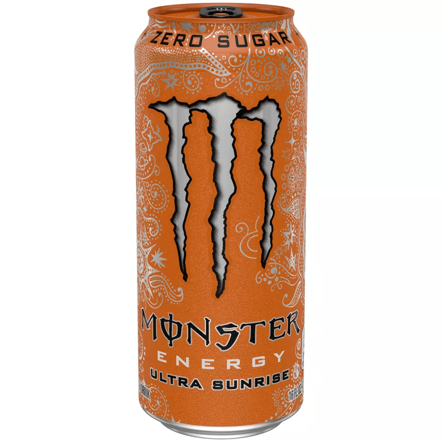
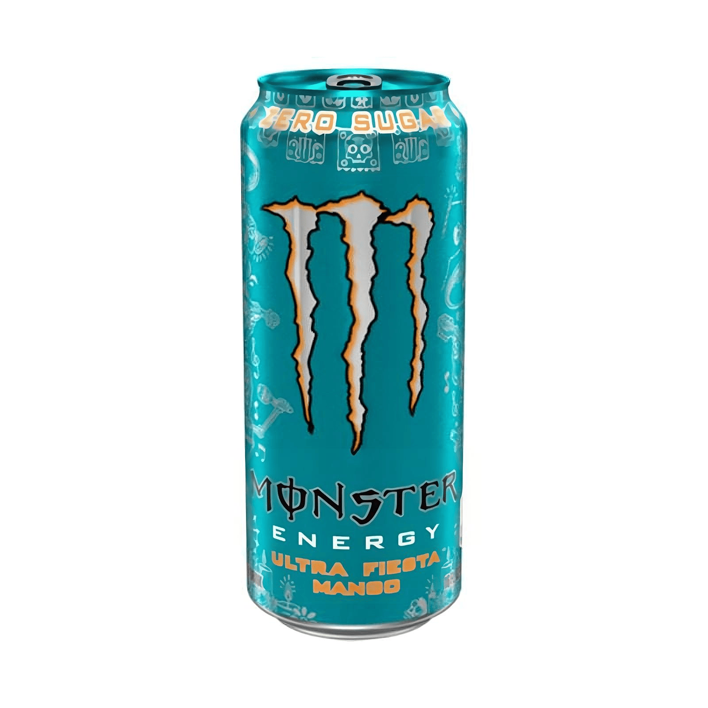
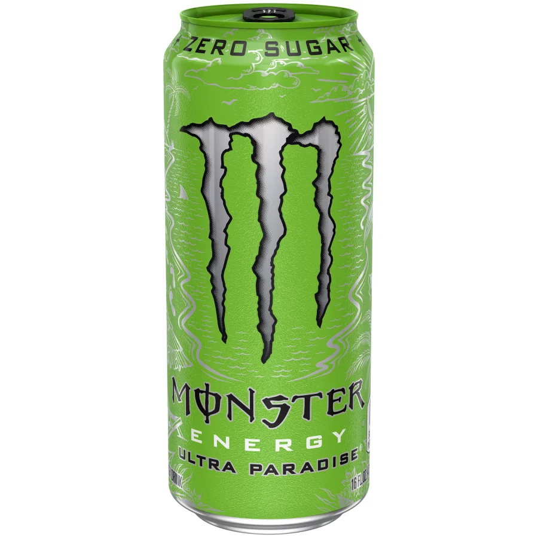
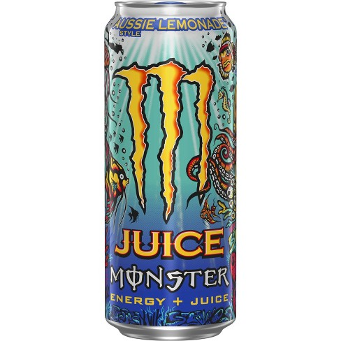
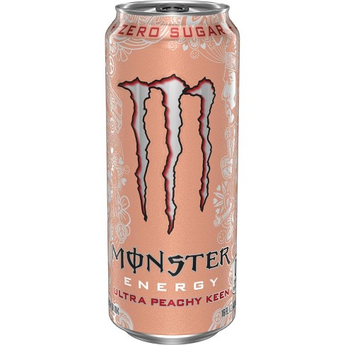
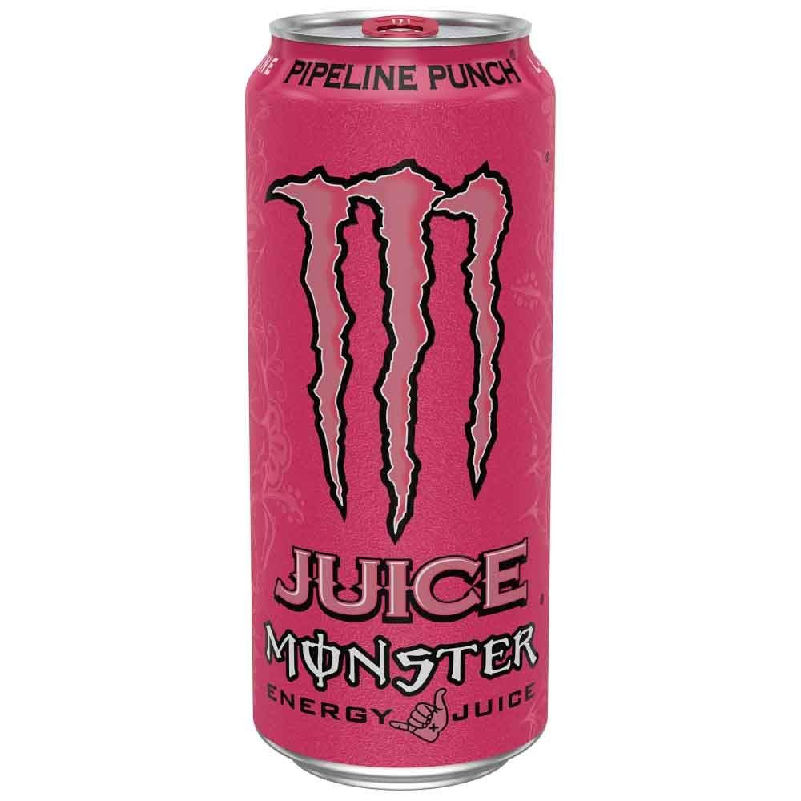

# **David's List**

</img>
 

`Original` rating: 6/10

- classic fuel flavor. When in doubt cannot go wrong
 - non-carbonated
 
 
</img> 

`Ultra Watermelon Zero Sugar` rating: 5.5/10

- tastes like watered down watermelon jolly rancher
- very sweet. leaves mouth feeling sugary
- carbonated
 
 
</img>

`Ultra Strawberry Dreams Zero Sugar` rating: 5.5/10

- tastes like multi-vitamin gummy bears
- not bad for an everyday drink 
- carbonated
 
 
</img>

`Ultra Violet Zero Sugar` rating: 5.5/10

- tastes like caprisun grape and fruit-punch mix
- carbonated
 
 
</img>

`Ultra Sunrise` rating: 2/10

- tastes like vitamin c powder. would not recommend
- carbonated
 
 
</img>

`Ultra Fiesta Mango` rating: 5/10

- Tastes like weaker mango juice
- carbonated
 
 
</img>

`Ultra Paradise` rating: 5/10

- A little bit of apple, pineapple. A little fruity like the bois
- hits the tongue with that little bit of sour power
- carbonated
 
 
</img>

`Aussie Lemonade` rating: 8/10

- Tastes like an energy drink version of brisk
- 50% sure it was carbonated. I was driving while drinking this so
 
 
</img>

`Ultra Peachy Keen` rating: 7/10

- The peach flavor tastes almost like that peachy korean candy. iykyk
- Honestly this tastes really good. It is sweet without feeling sweet but idk if thats because I am sleep deprived, physically tired from driving, and haven't eaten a meal in about 14 hours.
- carbonated
 
 
</img>

`Pipeline Punch` rating: 5.5/10

- pretty mid. 
- tastes like capri sun but when youre 4 pouches in 
- carbonated

