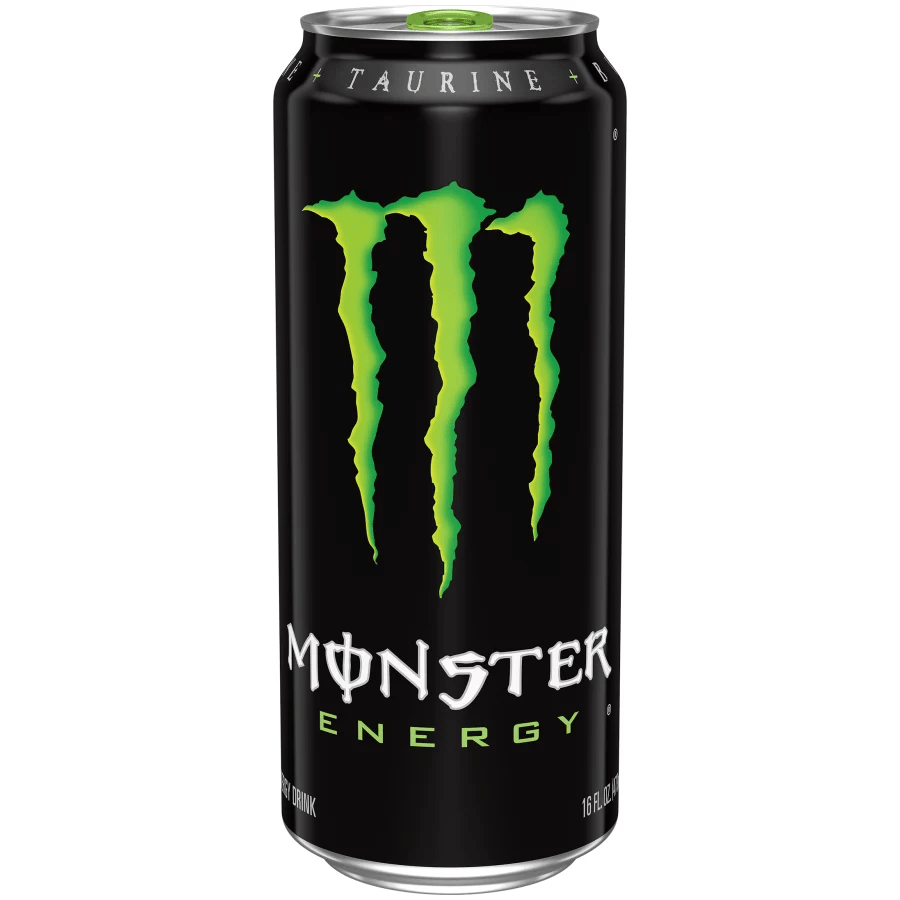
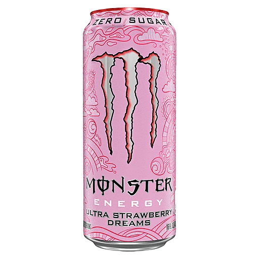

# **David's List**
</img>
`Original` rating: 6/10
    - classic fuel flavor. When in doubt cannot go wrong
    - non-carbonated
    
</img> 
`Ultra Watermelon Zero Sugar` rating: 6/10
    - tastes like watered down watermelon jolly rancher
    - very sweet. leaves mouth feeling sugary
    - carbonated

</img>
`Ultra Strawberry Dreams Zero Sugar` rating: 6/10
    - tastes like multi-vitamin gummy bears
    - not bad for an everyday drink 
    - carbonated

</img>
`Ultra Violet Zero Sugar` rating: 6.5/10
    - tastes like caprisun grape and fruit-punch mix
    - carbonated

</img>
`Ultra Sunrise` rating: 2/10
    - tastes like vitamin c power. would not recommend
    - carbonated
    - 
</img>
`Ultra Fiesta Mango` rating: 
    - Tastes like weaker mango juice
    - carbonated
