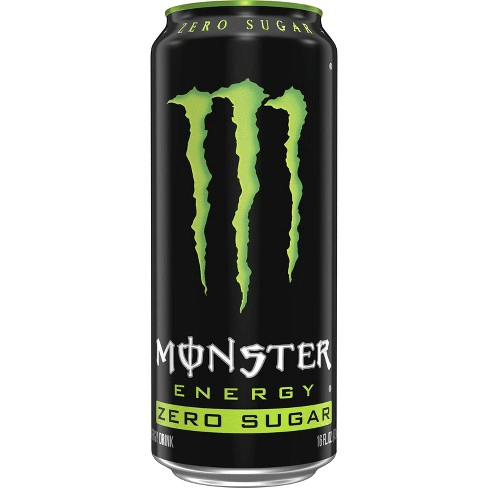
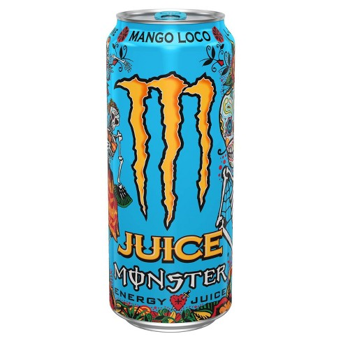
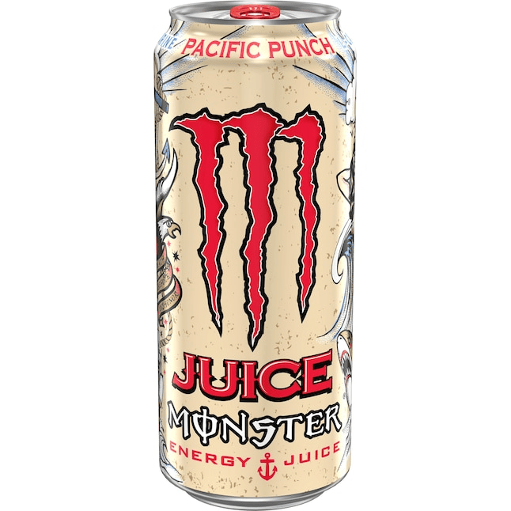
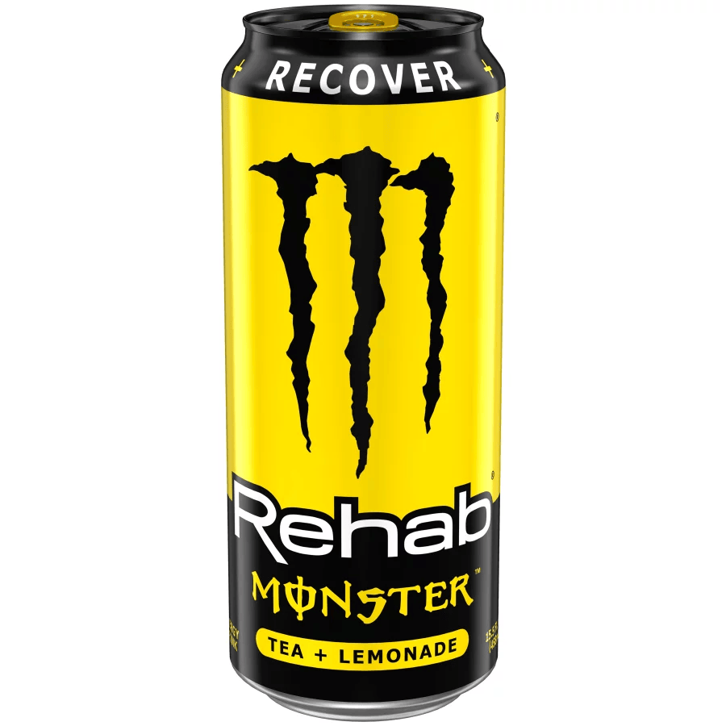
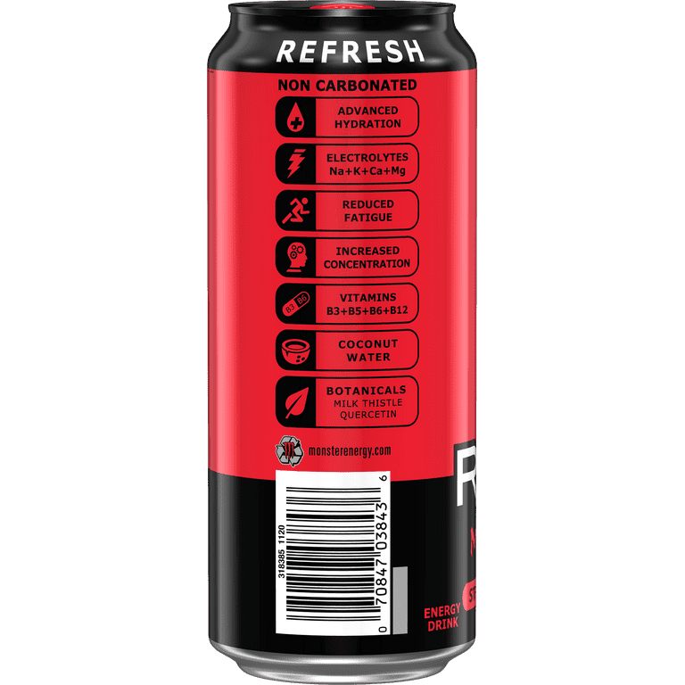

# **William's List**

``````
Just a little side note: I wholheartedly agree with most ratings given by David Koh. However, there are some other flavors that I would like to rate hence the separation of lists
``````

</img>
<br>

`Zero-Sugar` rating: *-2/10*
- The geniuses at Monster really looked at their original and said "Yeah customers would want a zero-sugar version"? Nah this is an absolute abomination, and I wouldn't be too surprised that this flavor only fairs well with obese fucks who think that a zero-sugar energy drink is what's keeping them alive. People who drink and enjoy the zero-sugar version are the type of fuckers who would drink a diet pepsi and say "This is great! I absolutely feel like I'm on a diet" when in reality, they're 2 fries away from the most painful heart attack known to man.
- I genuinely believe feeding this to a prisoner of war as a replacement for water is something that even Satan himself wouldn't do. There ya go CIA/FBI, I just gave you a new torture method, use it wisely.
<br>
<br>

</img>
<br>

`White Pineapple` rating: *7/10*
- I ain't gon lie this one's actually not that bad. Kinda tastes like pineapple fanta but less of the fanta
- carbonated, feels like a good combo to when you're at the park and having a pizza party with your friends
<br>
<br>

</img>
<br>

`Mango Loco` rating: *5/10*
- Alright the entire juice line feels like it was made to satisfy the taste buds of a 10 year old scooter boy who never washed their hands. Extremely fucking sweet, and I can genuinely feel my heart beating out of my fucking rib cage when drinking this. I'm not a big fan of either this or the fiesta mango, but if I had to fucking choose a mango flavored energy drink, it's definitely not this one
- Carbonated (I have no idea why this line is called juice if it's all carbonated), tastes like super sweet mango snapple or the trident mango gum, and quite frankly, if your grandma or grandpa flatlines and all seems lost, do yourself a favor: don't give them cpr, just pour this drink into their mouths and I guarantee you their hearts will jumpstart again
<br>
<br>

</img>
<br>

`Pacific Punch` rating: *6/10*
- This is Monster's attempt at a Hawaiian punch, and sure while it's not terrible, holy fuck is it sweet as hell. Some people will like this, and I say that's fine, but if one drink can give me 10 cavities simultaneously, I'm not too keen on drinking this on a daily basis, even IF I have a shit ton of work to do.
- Carbonated (once again I have no idea why this line is called juice if it's all carbonated), if you wanna drink hawaiian punch and stress test your immune system at the same time, then I guess this is the drink for you.
<br>
<br>

</img>
<br>

`Tea Lemonade` rating: *8/10*
- This is where it's at. Compared to the rest of the Monster drinks, this one isn't as sweet, but it gives you a slight kick that doesn't last till the next day
- Non carbonated, and tastes like a sweeter version of Arizona's Arnold Palmer drink (which is arguably my favorite)
<br>
<br>

</img>
<br>

`Tea Lemonade` rating: *9.5/10*
- This is chef's kiss. This is my version of a Wendy drink if it ever existed. The person who thought of this deserves a Nobel Peace Prize for his contributions to humanity. If I could, I would drink this drink and give the creator of this a nice strawberry and lemonade blowjob. Holy fuck this shit is soooo good, I would argue that this flavor ranks in the top 5 of any drinks I've ever had in my life. This drink has given me a new perspective on Strawberry Lemonade, and I am thoroughly convinced that if my future SO doesn't have a strawberry lemonade lipstick on and kissing me with that scent, I will do humanity a favor and just get of their existence on this planet
- Non carbonated, and is just the definition of perfection. I promise you Merriam Webster will change their definition of perfection from "the quality or state of being perfect" to just "Monster Strawberry Lemonade Rehab"
<br>
<br>